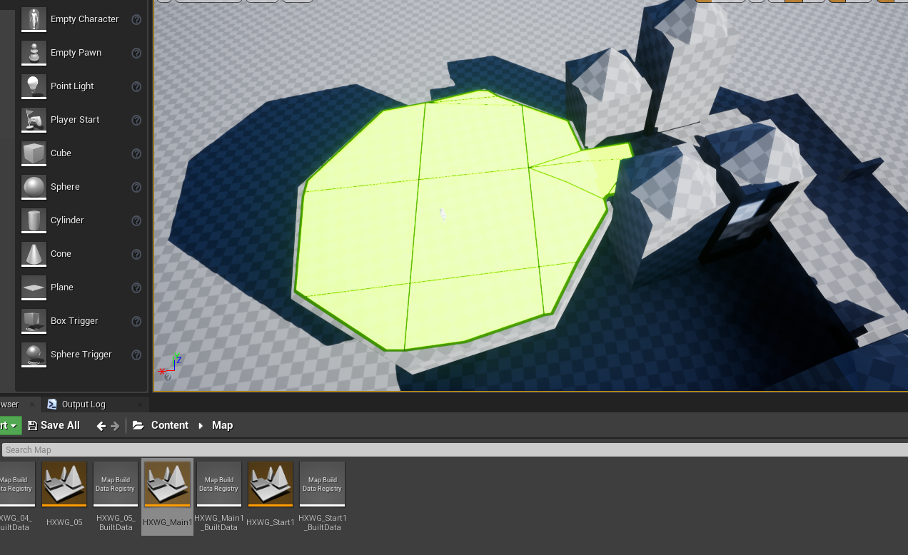
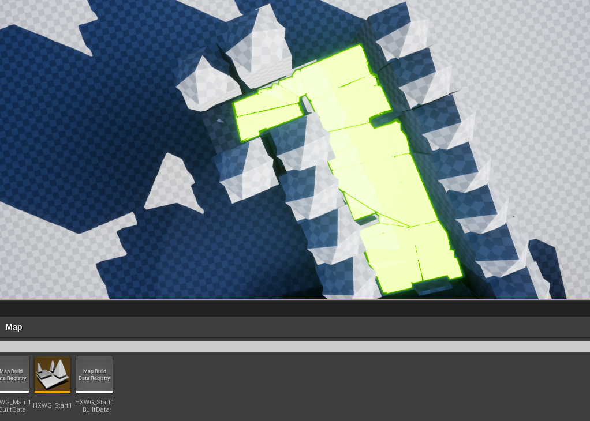

# NavTest1
将navmesh volume分到多个stream level中，重叠区域会有寻路边界的错误

Test:
1.Editor下寻路正常，每个level一个navmesh volume

volume边界

2.运行时分别单独加载stream level
第一关

第二关

3.由上可看Editor下和Runtime寻路边界并不相同，Runtime下会有缺失或多余，目前猜测与tile有关
